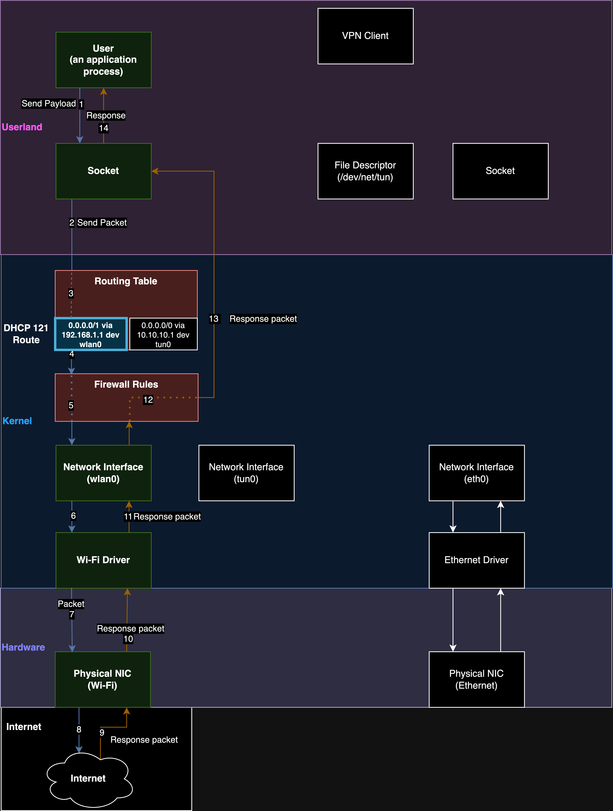

# TunnelVision: Decloaking Full and Split Tunnel VPNs
## CVE-2024-3661 

TunnelVision is a local network VPN leaking technique that allows an attacker to read, drop, and sometimes modify VPN traffic from a targets on the local network. This technique does not activate kill-switches and does not have a full fix we are aware of. We are using the built-in and widely supported feature DHCP option 121 to do this. 

Option 121 supports installing multiple routes with CIDR ranges. By installing multiple /1 routes an attacker can leak all traffic of a targeted user, or an attacker might choose to leak only certain IP addresses for stealth reasons. We're calling this effect **decloaking**.

TunnelVision has been theoretically exploitable since 2002, but has gone publicly unnoticed as far as we can tell. For this reason, we are publishing broadly to make the privacy and security industry aware of this capability. In addition, the mitigation we've observed from VPN providers renders a VPN pointless in public settings and challenges VPN providers' assurances that a VPN is able to "secure" a user's traffic on untrusted networks. It remains unclear if a full fix is possible as this is how networking is intended to work.

## TunnelVision Research Team
- Researchers:
	- [Lizzie Moratti](https://www.linkedin.com/in/lmoratti/)
	- [Dani Cronce](https://www.linkedin.com/in/danicronce/)
- Supported & Sponsored by: 
	- [Leviathan Security Group](https://www.leviathansecurity.com/)
- Video [Proof of Concept](https://www.youtube.com/@LeviathanSecurityGroup) TODO: Link Video here when uploaded.
- Full details at [TunnelVision blogpost]() TODO: Link here when public.

## Affected Operating Systems
TunnelVision appears to work on any operating system that has a DHCP client that implements support for DHCP option 121. Most modern operating systems support this such as Linux, Windows, and MacOS. Notably, Android does not appear to have support for option 121 and remains unaffected.

## Affected VPN Protocols
TunnelVision works regardless of any VPN protocol (Wireguard, OpenVPN, IPsec), ciphersuites, or other cryptographic properties. We use DHCP option 121 to route traffic away from the VPN's interface so no VPN encryption routine may happen. 

## Problems with observed mitigations
We have observed host-based firewalls that will drop traffic going over the physical interface talking to the DHCP server. The VPN tunnel will always remain intact, and since we can control which IPs will be dropped via option 121, this becomes a "selective denial-of-service" instead of decloaking traffic. This introduces a side-channel that can be used to deanonymize the destination of the VPN traffic. In addition, by denying all traffic, this can render the VPN entirely useless or tempt a user to self-debug their settings to remove this mitigation.

The attacker can allow all traffic for a period of time can use traffic analysis to create a baseline for the volume of traffic. They can then push routes that deny traffic for IPs or ranges and compare the volume of traffic against this baseline. Using statistics, it's possible to confirm whether the targeted user is talking to a particular IP address or space. This is most relevant in places where the government has banned certain services.

## Requirements to exploit 
1. An attacker is on the same local network as a targeted user
2. An attacker is able to control/modify the DHCP lease for the targeted user

## **How decloaking works:**
- We supply a lease that is valid for a short amount of time. For this lab, we use 30 seconds.
	- In some cases, Windows doesn't like 2-10 second ranges and has mixed results. Perhaps someone more familiar with its network stack could work around this but we were unable to. 
- The attacker changes the DHCP configuration to push option 121 classless static routes (RFC3442) to the victim.
	- As an attacker, we can control the IP or ranges we want to leak by adjusting the prefix length of the route we push. I.e. a /32 vs /1 prefix length.
- The routing table of the victim adds the route from DHCP automatically.
	- The highest prefix length match is chosen. I.e. a /32 route has a higher prefix length than a /1 route.
	- DHCP routes are *automatically configured to go over the same interface as the DHCP server*.
	- Routing decisions happen before the traffic can be encrypted (see appendix diagrams), so traffic will be unencrypted.
		- It does not matter what VPN protocol is in use or the strength of its encryption.
- The attacker sets themselves as the default gateway, so they can then read that unencrypted traffic before forwarding it.
	- The VPN tunnel remains connected and reports to the user that they are still connected.

## **Virtual Machine**
There is a [virtual machine image]() that will be easier to get up and running.  TODO: add link to image 

**username:** administrator  
**password:** password

## Manual DHCP Server Setup:
### Requirements:
- Use a Windows host for the VM lab
- Use VirtualBox for virtualizing

### VirtualBox VM config
1. Use `Ubuntu Server 22.04` ISO (https://ubuntu.com/download/server)
2. Configure a **bridged adapter** in the VMs settings
	- 
3. Configure an **internal network adapter** in the VMs settings
	- 
4. Start the machine follow default install options on the VM
	- Make sure to install OpenSSH and **allow password auth**
		
	- Do not install docker, we've seen issues with it
5. Log in via the VirtualBox console
	- 
6. `hostname -I `
	- The IP address is needed for the next step where we SSH from our Windows host
### Setting up the server
1. From your Windows host open Powershell `ssh administrator@{IP from Install Step 6}`
	- 
2. `git clone https://github.com/leviathansecurity/TunnelVision.git`
3. `cd TunnelVision`
4. `sudo ./configdhcpserver.sh` 
	- This will only need to be ran once
5. `sudo ./startup.sh `
	- This script will need to be ran each reboot
### Helpful DHCP Server commands:
#### Utility commands
- `cat /etc/dhcp/dhcpd.conf` 
	- Shows the current configuration 
- `sudo ~/TunnelVision/pushrouteconfig.sh `
	- Pushes a DHCP option 121 route for 8.8.8.8/32
- `sudo ~/TunnelVision/norouteconfig.sh` 
	- Allows you to switch back to pushing no routes for testing purposes
- `sudo systemctl status isc-dhcp-server` 
	- Shows current status of the DHCP server
- `sudo systemctl restart isc-dhcp-server`
	- Restarts the DHCP server, mandatory if you manually edit the config file
- `sudo systemctl start isc-dhcp-server`
	- Starts the DHCP server
- `sudo systemctl stop isc-dhcp-server`
	- Stops the DHCP server
- `sudo journalctl -u isc-dhcp-server.service | tail -n 50 `
	- Shows the last 50 log lines from the service
- `watch "journalctl -u isc-dhcp-server.service | tail -n 50"`
	- Shows the last 50 logs, and also refreshes every 2s by default
- `sudo tcpdump -i enp0s8 `
	- Shows the traffic on the internal network interface, you can use tcpdump filters such as "icmp" to filter to relevant traffic
#### Commands for editing configuration files:
- `vi /etc/dhcp/dhcpd.conf` or `nano /etc/dhcp/dhcpd.conf`
	- The configuration the server uses. 
- `vi /etc/dhcp/dhcpd-route.conf` or `nano /etc/dhcp/dhcpd-route.conf`
	- Used in pushrouteconfig.sh 
- `vi /etc/dhcp/dhcpd-noroute.conf` or `nano /etc/dhcp/dhcpd-noroute.conf`
	- Used in norouteconfig.sh 
## Lab Setup

### Rogue admin lab
After configuring the DHCP server, start a new VM that to mimic a VPN user.
1. Choose internal network for its network adapter in the VMs settings. This will mean it will obtain a DHCP lease from the server we control.
2. Install a VPN on the user machine.
3. (Optional) Turn off any VPN setting that enables a host-firewall rule to drop traffic to non-VPN interfaces on the victim machine.
4. Connect to the VPN.
5. On the attacker DHCP server, push the demo DHCP 121 route (8.8.8.8/32):
	- `sudo ./pushrouteconfig.sh` 
6. On the victim machine, show the route table and observe there is a route for 8.8.8.8 that goes over a non-VPN interface: 
	- Ubuntu command:   `ip route`  
	- Windows command:  `route print`
7. Ping 8.8.8.8 from the victim machine.
	- `ping 8.8.8.8`
8. Observe that it will either ping or will be dropped.
9. (Optional) Install Wireshark or tcpdump to the victim host and manually confirm the interface the ICMP traffic is using.
	- If ping is not working, observe it goes over NO interface which is the selective denial-of-service behavior
	- If ping is working, observe it is NOT going over the VPN tunnel
10. On the attacker DHCP server, observe you can read the unencrypted traffic.
	- `sudo tcpdump -i enp0s8 icmp` 
	- (enp0s8 should be the interface name you are serving DHCP over)
### Adjacent Host lab
[Coming Soon] We are still working on releasing our tool, however in our POC video you can observe a demo of this lab.
# Appendix
## **Data flow for a VPN working normally without malicious DHCP routes**  

## **Data flow for when an attacker is pushing 121 routes without a host firewall setting enabled, creating a leak.**  

## **Data flow for when an attacker is pushing 121 routes and the creates a selective denial of service instead of a leak due to the host-firewall setting being enabled.**  

